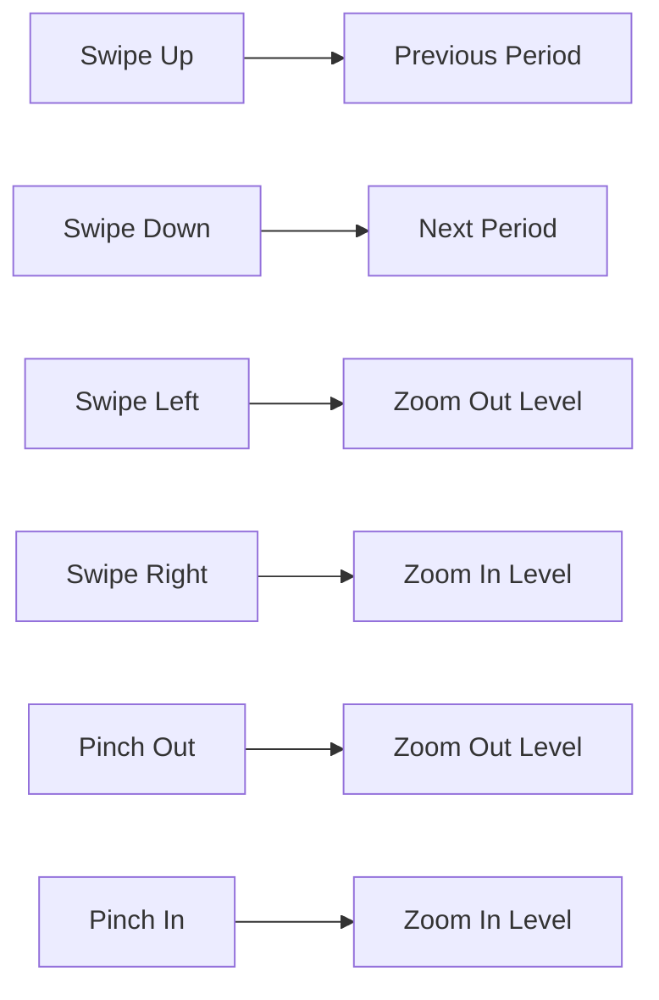
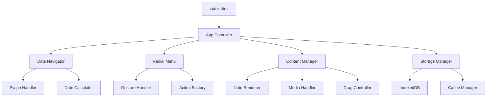

# Cosmic Journal - Product Specification

## Project Overview

Cosmic Journal is a gesture-driven personal journaling application that combines intuitive touch interactions with a minimalist aesthetic. The app features TikTok-like date navigation through swiping and a sophisticated radial menu system for content creation.

## Core Features

### 1. Date Navigation System

#### Swipe Gesture System


#### Navigation Rules
- **Vertical Swipes (Up/Down)**: Navigate through time
  - Day view: Previous/Next day
  - Week view: Previous/Next week
  - Month view: Previous/Next month
  - Year view: Previous/Next year
- **Horizontal Swipes (Left/Right)**: Change zoom level
  - Swipe Left: Zoom out (Day → Week → Month → Year)
  - Swipe Right: Zoom in (Year → Month → Week → Day)
- **Pinch Gestures**: Alternative zoom control
- **Double Tap**: Return to today's date

#### View Level Specifications

##### Day View
- **Layout**: Full-screen canvas for content placement
- **Header**: "Monday, January 15, 2025" format
- **Content**: All notes positioned at saved x,y coordinates
- **Grid**: Invisible 8px grid for subtle alignment
- **Interaction**: Long-press for radial menu
- **Clock**: Real-time clock in corner (optional)
- **Swipe sensitivity**: 50px minimum for trigger

##### Week View
- **Layout**: 7-day horizontal strip
- **Header**: "Week 3, January 2025"
- **Days**: Vertical columns with day abbreviations
- **Content**: Mini thumbnails of daily content
- **Highlight**: Current day with subtle border
- **Tap**: Any day to zoom into day view
- **Preview**: Show 3-5 items per day maximum

##### Month View
- **Layout**: Traditional calendar grid (7x5)
- **Header**: "January 2025"
- **Cells**: Day numbers with content indicators
- **Indicators**: Dots showing content density
  - 1 dot: 1-3 items
  - 2 dots: 4-7 items
  - 3 dots: 8+ items
- **Current**: Today highlighted with ring
- **Tap**: Any date to zoom into day view

##### Year View
- **Layout**: 12-month grid (3x4 or 4x3)
- **Header**: "2025"
- **Months**: Mini calendar thumbnails
- **Heatmap**: Content density visualization
  - Darker = more content
  - Lighter = less content
- **Tap**: Any month to zoom into month view
- **Annual stats**: Total items counter

### 2. Radial Menu System
- **Long-press activation**: Hold finger on empty space to activate
- **Gesture-based selection**: Drag distance determines action selection
- **Visual feedback**: Animated dashed circle with directional rotation
- **Action line**: Direct line from initial press to finger position
- **9 Action types**: Note, Photo, Audio, Video, Todos, Timer, Email, Thai Learning, AI Chat

### 3. Content Management
- **Draggable positioning**: All content items can be repositioned
- **Delete gesture**: Drag to recycle bin for deletion
- **Persistent storage**: IndexedDB for offline capability
- **Responsive layout**: Smartphone-first with desktop support

## Technology Stack

- **Frontend**: Vanilla JavaScript, HTML5, CSS3
- **Storage**: IndexedDB for offline persistence
- **Icons**: SVG for scalability and monochromatic design
- **Gestures**: Native touch events for optimal performance

## Code Organization Rules

### File Size Constraints
- **HARD LIMIT**: 300 lines per file maximum
- **Target**: 150-250 lines for optimal readability
- **Split Strategy**: When approaching 300 lines, break into:
  - Separate concern modules
  - Utility functions
  - Configuration objects
  - Sub-components

### Example Split Pattern
```javascript
// Bad: single 600-line file
app.js (600 lines) ❌

// Good: split by responsibility
app.js (120 lines) - Main controller ✓
app-gestures.js (180 lines) - Touch handling ✓
app-rendering.js (200 lines) - View rendering ✓
app-state.js (100 lines) - State management ✓
```

## Configuration System

### Settings.json Specification
**File**: `settings.json`
**Purpose**: User-customizable theme, fonts, and app behavior

```json
{
  "theme": {
    "name": "cosmic-dark",
    "colors": {
      "background": "#1a1a1a",
      "surface": "#242424",
      "primary": "rgba(255, 255, 255, 0.95)",
      "secondary": "rgba(255, 255, 255, 0.7)",
      "tertiary": "rgba(255, 255, 255, 0.5)",
      "accent": "rgba(255, 255, 255, 0.3)",
      "border": "rgba(255, 255, 255, 0.15)",
      "shadow": "rgba(0, 0, 0, 0.5)",
      "error": "#ff4444",
      "success": "#44ff44",
      "warning": "#ffaa44"
    },
    "noteShades": [
      "rgba(255, 255, 255, 0.1)",
      "rgba(255, 255, 255, 0.2)",
      "rgba(255, 255, 255, 0.3)",
      "rgba(255, 255, 255, 0.4)",
      "rgba(255, 255, 255, 0.5)"
    ]
  },
  "typography": {
    "fontFamily": {
      "primary": "-apple-system, BlinkMacSystemFont, 'Segoe UI', Roboto, 'Helvetica Neue', Arial, sans-serif",
      "mono": "'SF Mono', Monaco, 'Cascadia Code', 'Roboto Mono', Consolas, 'Courier New', monospace",
      "handwriting": "'Kalam', 'Comic Sans MS', cursive"
    },
    "fontSize": {
      "xs": "11px",
      "sm": "13px",
      "base": "16px",
      "lg": "20px",
      "xl": "24px",
      "xxl": "32px"
    },
    "fontWeight": {
      "light": 300,
      "regular": 400,
      "medium": 500,
      "semibold": 600,
      "bold": 700
    },
    "lineHeight": {
      "tight": 1.2,
      "normal": 1.5,
      "relaxed": 1.75
    }
  },
  "animations": {
    "duration": {
      "instant": "0ms",
      "fast": "150ms",
      "normal": "300ms",
      "slow": "500ms",
      "slower": "1000ms"
    },
    "easing": {
      "linear": "linear",
      "ease": "ease",
      "easeIn": "ease-in",
      "easeOut": "ease-out",
      "easeInOut": "cubic-bezier(0.4, 0, 0.2, 1)",
      "bounce": "cubic-bezier(0.68, -0.55, 0.265, 1.55)"
    }
  },
  "gestures": {
    "swipeThreshold": 50,
    "longPressDelay": 500,
    "doubleTapDelay": 300,
    "dragThreshold": 10,
    "pinchSensitivity": 0.02
  },
  "radialMenu": {
    "radius": 60,
    "lineColor": "rgba(255, 255, 255, 0.6)",
    "circleColor": "rgba(255, 255, 255, 0.4)",
    "rotationSpeed": 4000,
    "distancePerOption": 30
  },
  "features": {
    "showClock": true,
    "showWeather": false,
    "autoSave": true,
    "autoSaveInterval": 5000,
    "enableHaptics": true,
    "enableSounds": false
  },
  "presets": {
    "themes": [
      {
        "id": "cosmic-dark",
        "name": "Cosmic Dark (Default)",
        "description": "Monochromatic dark theme"
      },
      {
        "id": "paper-light",
        "name": "Paper Light",
        "description": "Clean white background",
        "colors": {
          "background": "#ffffff",
          "primary": "#1a1a1a"
        }
      },
      {
        "id": "ocean-blue",
        "name": "Ocean Blue",
        "description": "Deep blue theme",
        "colors": {
          "background": "#0a1628",
          "primary": "#a7c7e7"
        }
      },
      {
        "id": "forest-green",
        "name": "Forest Green",
        "description": "Natural green theme",
        "colors": {
          "background": "#1a2f1a",
          "primary": "#90ee90"
        }
      }
    ]
  }
}
```

### Settings Loader Module
**File**: `scripts/config/settings-loader.js`
```javascript
// settings-loader.js - Load and apply user settings
class SettingsLoader {
    constructor() {
        this.settings = null;
        this.cssVariables = new Map();
    }
    
    async load() {
        const response = await fetch('/settings.json');
        this.settings = await response.json();
        this.applyTheme();
        this.applyTypography();
        return this.settings;
    }
    
    applyTheme() {
        const root = document.documentElement;
        const colors = this.settings.theme.colors;
        
        // Apply CSS variables
        root.style.setProperty('--color-bg', colors.background);
        root.style.setProperty('--color-primary', colors.primary);
        root.style.setProperty('--color-secondary', colors.secondary);
        // ... etc
    }
    
    applyTypography() {
        const root = document.documentElement;
        const fonts = this.settings.typography;
        
        root.style.setProperty('--font-primary', fonts.fontFamily.primary);
        root.style.setProperty('--font-size-base', fonts.fontSize.base);
        // ... etc
    }
    
    updateSetting(path, value) {
        // Dynamic setting updates
        // Save to localStorage for persistence
    }
}
```

## Design System (Configurable via settings.json)

### Default Color Palette
- **Primary**: `#1a1a1a` (Dark background)
- **Secondary**: `rgba(255, 255, 255, 0.9)` (Primary text)
- **Accent**: `rgba(255, 255, 255, 0.6)` (Secondary elements)
- **Subtle**: `rgba(255, 255, 255, 0.3)` (Borders, dividers)

### Default Typography
- **Primary Font**: System font stack for performance
- **Header**: 24px, bold
- **Body**: 16px, regular
- **Small**: 12px, regular

### Spacing
- **Base unit**: 8px
- **Small**: 4px
- **Medium**: 16px
- **Large**: 32px

## Architecture Overview



## File Structure (All files < 300 lines)

```
/
├── index.html                    # Main entry point (~50 lines)
├── settings.json                 # User configuration (~100 lines)
├── styles/
│   ├── main.css                 # Core styles (~250 lines)
│   ├── components.css           # Component styles (~200 lines)
│   ├── animations.css           # Transitions (~100 lines)
│   └── responsive.css           # Media queries (~150 lines)
├── scripts/
│   ├── app.js                   # Main controller (~200 lines)
│   ├── navigation/
│   │   ├── swipe-handler.js     # Gesture detection (~150 lines)
│   │   ├── date-navigator.js    # Date logic (~200 lines)
│   │   └── view-renderer.js     # View templates (~250 lines)
│   ├── radial-menu/
│   │   ├── menu-controller.js   # Menu logic (~200 lines)
│   │   ├── gesture-tracker.js   # Touch tracking (~150 lines)
│   │   └── action-factory.js    # Action creators (~200 lines)
│   ├── content/
│   │   ├── content-manager.js   # CRUD operations (~200 lines)
│   │   ├── drag-controller.js   # Drag & drop (~150 lines)
│   │   ├── note-renderer.js     # Note display (~150 lines)
│   │   └── media-handler.js     # Photo/video (~200 lines)
│   ├── storage/
│   │   ├── db-manager.js        # IndexedDB (~150 lines)
│   │   └── cache.js             # Memory cache (~100 lines)
│   ├── config/
│   │   └── settings-loader.js   # Load & apply settings (~100 lines)
│   └── utils/
│       ├── constants.js         # App constants (~50 lines)
│       ├── helpers.js            # Utility functions (~150 lines)
│       └── icons.js              # SVG icon library (~200 lines)
├── assets/
│   └── icons/                   # SVG files
└── docs/
    └── product.md               # This document
```

## Component Specifications

### Date Navigation Component

#### Swipe Handler Module
**File**: `scripts/navigation/swipe-handler.js` (max 150 lines)
```javascript
// swipe-handler.js - Touch gesture detection and processing
class SwipeHandler {
    constructor(onSwipe) {
        this.threshold = 50; // Minimum distance for swipe
        this.velocity = 0.3; // Minimum velocity
        this.touchStart = null;
        this.touchEnd = null;
        this.onSwipe = onSwipe;
    }
    
    detectSwipe(startX, startY, endX, endY, duration) {
        const deltaX = endX - startX;
        const deltaY = endY - startY;
        const distance = Math.sqrt(deltaX**2 + deltaY**2);
        
        if (distance < this.threshold) return null;
        
        const angle = Math.atan2(deltaY, deltaX) * 180 / Math.PI;
        
        // Determine swipe direction based on angle
        if (angle > -45 && angle <= 45) return 'right';
        if (angle > 45 && angle <= 135) return 'down';
        if (angle > 135 || angle <= -135) return 'left';
        if (angle > -135 && angle <= -45) return 'up';
    }
}
```

#### Date Navigator Module  
**File**: `scripts/navigation/date-navigator.js` (max 200 lines)
```javascript
// date-navigator.js - Date calculations and period navigation
class DateNavigator {
    constructor() {
        this.currentDate = new Date();
        this.viewLevel = 'day'; // day, week, month, year
        this.viewLevels = ['day', 'week', 'month', 'year'];
    }
    
    navigatePeriod(direction) {
        const delta = direction === 'up' ? -1 : 1;
        
        switch(this.viewLevel) {
            case 'day':
                this.currentDate.setDate(this.currentDate.getDate() + delta);
                break;
            case 'week':
                this.currentDate.setDate(this.currentDate.getDate() + (delta * 7));
                break;
            case 'month':
                this.currentDate.setMonth(this.currentDate.getMonth() + delta);
                break;
            case 'year':
                this.currentDate.setFullYear(this.currentDate.getFullYear() + delta);
                break;
        }
    }
    
    zoomLevel(direction) {
        const currentIndex = this.viewLevels.indexOf(this.viewLevel);
        const newIndex = direction === 'in' ? 
            Math.max(0, currentIndex - 1) : 
            Math.min(3, currentIndex + 1);
        this.viewLevel = this.viewLevels[newIndex];
    }
}
```

#### View Renderer Module
**File**: `scripts/navigation/view-renderer.js` (max 250 lines)
```javascript
// view-renderer.js - Render different calendar view levels
class ViewRenderer {
    renderDay(date, content) {
        // Render full-screen canvas with positioned notes
    }
    
    renderWeek(date, content) {
        // Render 7-day strip with content previews
    }
    
    renderMonth(date, content) {
        // Render calendar grid with density indicators
    }
    
    renderYear(date, content) {
        // Render 12-month overview with heatmap
    }
}
```

### Radial Menu Component
**File**: `scripts/radial-menu.js`
**Purpose**: Gesture-based action selection system

```javascript
// radial-menu.js - Radial menu system with gesture recognition
class RadialMenu {
    constructor() {
        this.actions = [
            { name: 'note', icon: 'edit', label: 'Note' },
            { name: 'photo', icon: 'camera', label: 'Photo' },
            // ... 7 more actions
        ];
        this.setupGestureHandlers();
    }
    
    // Key methods:
    // - show(x, y) - Display menu at coordinates
    // - updateSelection(distance) - Change selected action
    // - executeAction(actionName) - Perform selected action
}
```

### Content Manager Component
**File**: `scripts/content-manager.js`
**Purpose**: Handle all content types and interactions

```javascript
// content-manager.js - Content creation and management
class ContentManager {
    constructor(storage) {
        this.storage = storage;
        this.setupDragHandlers();
    }
    
    // Key methods:
    // - createNote(type, x, y) - Create new content
    // - renderContent() - Display all content for current date
    // - startDrag() / endDrag() - Handle repositioning
}
```

### Storage Manager Component
**File**: `scripts/storage.js`
**Purpose**: IndexedDB operations and data persistence

```javascript
// storage.js - IndexedDB storage and data management
class StorageManager {
    constructor() {
        this.dbName = 'CosmicJournalDB';
        this.version = 1;
        this.init();
    }
    
    // Key methods:
    // - save(note) - Store content item
    // - load(date) - Retrieve content for date
    // - delete(id) - Remove content item
}
```

## Action Type Specifications

### 1. Note Action
- **UI**: Text input with rich formatting
- **Storage**: Plain text with markdown support
- **Features**: Auto-save, character count

### 2. Photo Action
- **UI**: Camera capture interface
- **Storage**: Base64 encoded images
- **Features**: Thumbnail generation, full-size overlay

### 3. Audio Action
- **UI**: Recording interface with waveform
- **Storage**: Audio blob data
- **Features**: Play/pause controls, duration display

### 4. Video Action
- **UI**: Video capture interface
- **Storage**: Video blob data
- **Features**: Playback controls, thumbnail preview

### 5. Todos Action
- **UI**: Checkbox list with add/remove
- **Storage**: Markdown-style checklist format
- **Features**: Drag to reorder, completion tracking

### 6. Timer Action
- **UI**: Pomodoro-style timer interface
- **Storage**: Timer settings and session history
- **Features**: Start/pause/reset, notification alerts

### 7. Email Action
- **UI**: Quick compose interface
- **Integration**: Gmail compose API
- **Features**: Direct email launch

### 8. Thai Learning Action
- **UI**: Word of the day display
- **Storage**: Learning progress tracking
- **Features**: Translation, pronunciation guide

### 9. AI Chat Action
- **UI**: Chat bubble interface
- **Integration**: AI API integration
- **Features**: Context-aware responses

## Data Models

### Note Model
```javascript
{
    id: String,           // Unique identifier
    type: String,         // note, photo, audio, video, todos, timer
    content: String,      // Content data
    date: String,         // Date key (YYYY-MM-DD)
    x: Number,           // X position on screen
    y: Number,           // Y position on screen
    shade: Number,       // Color variant (1-5)
    timestamp: Number,   // Creation time
    metadata: Object     // Type-specific data
}
```

### Date Key Format
- **Day**: `YYYY-MM-DD`
- **Week**: `YYYY-WXX`
- **Month**: `YYYY-MM`
- **Year**: `YYYY`

## Responsive Design

### Mobile First (320px+)
- Touch-optimized interactions
- Gesture-based navigation
- Full-screen content views
- Minimal UI chrome

### Tablet (768px+)
- Larger touch targets
- Side-by-side content views
- Enhanced gesture recognition

### Desktop (1024px+)
- Mouse and keyboard support
- Hover states for interactions
- Keyboard shortcuts
- Multi-column layouts

## Transition Animations

### View Transition Effects
- **Day ↔ Week**: Zoom in/out with scale transform
- **Week ↔ Month**: Morph animation between layouts
- **Month ↔ Year**: Grid collapse/expand effect
- **Vertical Navigation**: Slide up/down with parallax
- **Horizontal Navigation**: Slide left/right with fade

### Animation Specifications
```css
/* Swipe transitions */
.view-transition-vertical {
    animation: slideVertical 0.3s ease-out;
}

.view-transition-horizontal {
    animation: slideHorizontal 0.3s ease-out;
}

.view-transition-zoom {
    animation: zoomTransition 0.4s cubic-bezier(0.4, 0, 0.2, 1);
}

@keyframes slideVertical {
    from { transform: translateY(100%); opacity: 0; }
    to { transform: translateY(0); opacity: 1; }
}
```

## Performance Requirements

- **First Paint**: < 1s
- **Touch Response**: < 16ms (immediate feedback)
- **Swipe Recognition**: < 100ms
- **Animation**: 60fps consistent
- **View Transition**: < 300ms
- **Storage**: < 50MB local data
- **Memory**: < 100MB RAM usage

## Browser Support

- **Mobile**: iOS Safari 12+, Chrome 70+
- **Desktop**: Chrome 70+, Firefox 65+, Safari 12+
- **Features**: Touch events, IndexedDB, File API, Web Audio API

## Development Phases

### Phase 1: Core Navigation
- Date navigation system
- Basic swiping mechanics
- Simple note creation

### Phase 2: Radial Menu
- Gesture recognition
- Action selection system
- Visual feedback animations

### Phase 3: Content Types
- Photo/video capture
- Audio recording
- Todo list functionality

### Phase 4: Advanced Features
- Drag and drop positioning
- Timer functionality
- External integrations

### Phase 5: Polish
- Performance optimization
- Enhanced animations
- Accessibility features

## Testing Strategy

### Unit Testing
- Individual component functionality
- Storage operations
- Date calculations

### Integration Testing
- Cross-component interactions
- Touch event handling
- Data persistence

### User Testing
- Gesture recognition accuracy
- Performance on various devices
- Usability feedback

## Deployment

### Build Process
- CSS/JS minification
- Image optimization
- Service worker for offline capability

### Hosting
- Static file hosting (Netlify, Vercel)
- CDN for global performance
- HTTPS required for camera access

This specification provides a complete blueprint for building Cosmic Journal as a clean, modular, and maintainable application. Each component is designed to be under 300 lines and focused on a single responsibility.