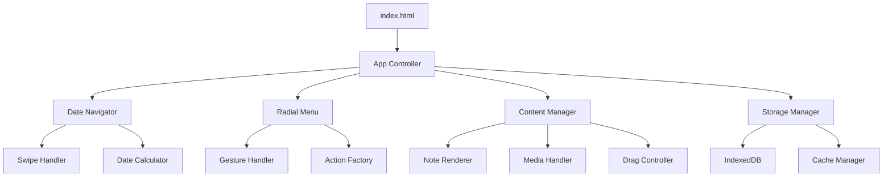

# Cosmic Journal - Product Specification

## Project Overview

Cosmic Journal is a gesture-driven personal journaling application that combines intuitive touch interactions with a minimalist aesthetic. The app features TikTok-like date navigation through swiping and a sophisticated radial menu system for content creation.

## Core Features

### 1. Date Navigation System
- **TikTok-style swiping**: Vertical swipes navigate between time periods
- **Multi-level zoom**: Day → Week → Month → Year views
- **Smooth transitions**: Animated transitions between date levels
- **Today indicator**: Clear visual indication of current date

### 2. Radial Menu System
- **Long-press activation**: Hold finger on empty space to activate
- **Gesture-based selection**: Drag distance determines action selection
- **Visual feedback**: Animated dashed circle with directional rotation
- **Action line**: Direct line from initial press to finger position
- **9 Action types**: Note, Photo, Audio, Video, Todos, Timer, Email, Thai Learning, AI Chat

### 3. Content Management
- **Draggable positioning**: All content items can be repositioned
- **Delete gesture**: Drag to recycle bin for deletion
- **Persistent storage**: IndexedDB for offline capability
- **Responsive layout**: Smartphone-first with desktop support

## Technology Stack

- **Frontend**: Vanilla JavaScript, HTML5, CSS3
- **Storage**: IndexedDB for offline persistence
- **Icons**: SVG for scalability and monochromatic design
- **Gestures**: Native touch events for optimal performance

## Design System

### Color Palette
- **Primary**: `#1a1a1a` (Dark background)
- **Secondary**: `rgba(255, 255, 255, 0.9)` (Primary text)
- **Accent**: `rgba(255, 255, 255, 0.6)` (Secondary elements)
- **Subtle**: `rgba(255, 255, 255, 0.3)` (Borders, dividers)

### Typography
- **Primary Font**: System font stack for performance
- **Header**: 24px, bold
- **Body**: 16px, regular
- **Small**: 12px, regular

### Spacing
- **Base unit**: 8px
- **Small**: 4px
- **Medium**: 16px
- **Large**: 32px

## Architecture Overview



## File Structure

```
/
├── index.html                 # Main entry point
├── styles/
│   ├── main.css              # Core styles and layout
│   ├── components.css        # Component-specific styles
│   └── responsive.css        # Media queries
├── scripts/
│   ├── app.js               # Main application controller
│   ├── navigation.js        # Date navigation and swiping
│   ├── radial-menu.js       # Radial menu system
│   ├── content-manager.js   # Note and media management
│   ├── storage.js           # IndexedDB operations
│   └── utils.js             # Shared utilities
├── assets/
│   └── icons/               # SVG icon library
└── docs/
    └── product.md           # This document
```

## Component Specifications

### Date Navigation Component
**File**: `scripts/navigation.js`
**Purpose**: Handle date traversal and view transitions

```javascript
// navigation.js - Date navigation and swiping system
class DateNavigator {
    constructor() {
        this.currentDate = new Date();
        this.viewLevel = 'day'; // day, week, month, year
        this.setupSwipeHandlers();
    }
    
    // Key methods:
    // - swipeUp() / swipeDown() - Navigate dates
    // - zoomIn() / zoomOut() - Change view levels
    // - renderCalendar() - Display current view
}
```

### Radial Menu Component
**File**: `scripts/radial-menu.js`
**Purpose**: Gesture-based action selection system

```javascript
// radial-menu.js - Radial menu system with gesture recognition
class RadialMenu {
    constructor() {
        this.actions = [
            { name: 'note', icon: 'edit', label: 'Note' },
            { name: 'photo', icon: 'camera', label: 'Photo' },
            // ... 7 more actions
        ];
        this.setupGestureHandlers();
    }
    
    // Key methods:
    // - show(x, y) - Display menu at coordinates
    // - updateSelection(distance) - Change selected action
    // - executeAction(actionName) - Perform selected action
}
```

### Content Manager Component
**File**: `scripts/content-manager.js`
**Purpose**: Handle all content types and interactions

```javascript
// content-manager.js - Content creation and management
class ContentManager {
    constructor(storage) {
        this.storage = storage;
        this.setupDragHandlers();
    }
    
    // Key methods:
    // - createNote(type, x, y) - Create new content
    // - renderContent() - Display all content for current date
    // - startDrag() / endDrag() - Handle repositioning
}
```

### Storage Manager Component
**File**: `scripts/storage.js`
**Purpose**: IndexedDB operations and data persistence

```javascript
// storage.js - IndexedDB storage and data management
class StorageManager {
    constructor() {
        this.dbName = 'CosmicJournalDB';
        this.version = 1;
        this.init();
    }
    
    // Key methods:
    // - save(note) - Store content item
    // - load(date) - Retrieve content for date
    // - delete(id) - Remove content item
}
```

## Action Type Specifications

### 1. Note Action
- **UI**: Text input with rich formatting
- **Storage**: Plain text with markdown support
- **Features**: Auto-save, character count

### 2. Photo Action
- **UI**: Camera capture interface
- **Storage**: Base64 encoded images
- **Features**: Thumbnail generation, full-size overlay

### 3. Audio Action
- **UI**: Recording interface with waveform
- **Storage**: Audio blob data
- **Features**: Play/pause controls, duration display

### 4. Video Action
- **UI**: Video capture interface
- **Storage**: Video blob data
- **Features**: Playback controls, thumbnail preview

### 5. Todos Action
- **UI**: Checkbox list with add/remove
- **Storage**: Markdown-style checklist format
- **Features**: Drag to reorder, completion tracking

### 6. Timer Action
- **UI**: Pomodoro-style timer interface
- **Storage**: Timer settings and session history
- **Features**: Start/pause/reset, notification alerts

### 7. Email Action
- **UI**: Quick compose interface
- **Integration**: Gmail compose API
- **Features**: Direct email launch

### 8. Thai Learning Action
- **UI**: Word of the day display
- **Storage**: Learning progress tracking
- **Features**: Translation, pronunciation guide

### 9. AI Chat Action
- **UI**: Chat bubble interface
- **Integration**: AI API integration
- **Features**: Context-aware responses

## Data Models

### Note Model
```javascript
{
    id: String,           // Unique identifier
    type: String,         // note, photo, audio, video, todos, timer
    content: String,      // Content data
    date: String,         // Date key (YYYY-MM-DD)
    x: Number,           // X position on screen
    y: Number,           // Y position on screen
    shade: Number,       // Color variant (1-5)
    timestamp: Number,   // Creation time
    metadata: Object     // Type-specific data
}
```

### Date Key Format
- **Day**: `YYYY-MM-DD`
- **Week**: `YYYY-WXX`
- **Month**: `YYYY-MM`
- **Year**: `YYYY`

## Responsive Design

### Mobile First (320px+)
- Touch-optimized interactions
- Gesture-based navigation
- Full-screen content views
- Minimal UI chrome

### Tablet (768px+)
- Larger touch targets
- Side-by-side content views
- Enhanced gesture recognition

### Desktop (1024px+)
- Mouse and keyboard support
- Hover states for interactions
- Keyboard shortcuts
- Multi-column layouts

## Performance Requirements

- **First Paint**: < 1s
- **Touch Response**: < 16ms
- **Animation**: 60fps
- **Storage**: < 50MB local data
- **Memory**: < 100MB RAM usage

## Browser Support

- **Mobile**: iOS Safari 12+, Chrome 70+
- **Desktop**: Chrome 70+, Firefox 65+, Safari 12+
- **Features**: Touch events, IndexedDB, File API, Web Audio API

## Development Phases

### Phase 1: Core Navigation
- Date navigation system
- Basic swiping mechanics
- Simple note creation

### Phase 2: Radial Menu
- Gesture recognition
- Action selection system
- Visual feedback animations

### Phase 3: Content Types
- Photo/video capture
- Audio recording
- Todo list functionality

### Phase 4: Advanced Features
- Drag and drop positioning
- Timer functionality
- External integrations

### Phase 5: Polish
- Performance optimization
- Enhanced animations
- Accessibility features

## Testing Strategy

### Unit Testing
- Individual component functionality
- Storage operations
- Date calculations

### Integration Testing
- Cross-component interactions
- Touch event handling
- Data persistence

### User Testing
- Gesture recognition accuracy
- Performance on various devices
- Usability feedback

## Deployment

### Build Process
- CSS/JS minification
- Image optimization
- Service worker for offline capability

### Hosting
- Static file hosting (Netlify, Vercel)
- CDN for global performance
- HTTPS required for camera access

This specification provides a complete blueprint for building Cosmic Journal as a clean, modular, and maintainable application. Each component is designed to be under 300 lines and focused on a single responsibility.